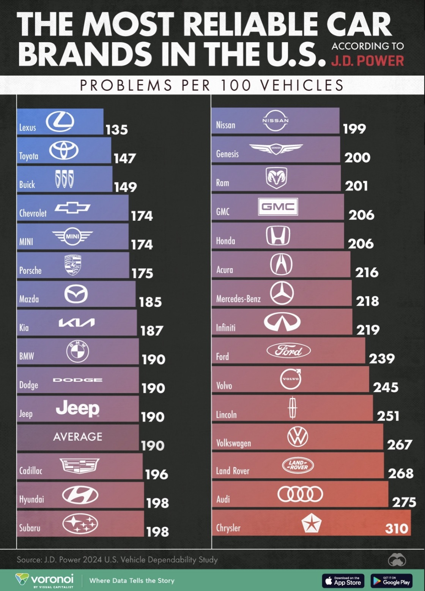

| [home page](https://cmustudent.github.io/tswd-portfolio-templates/) | [data viz examples](dataviz-examples) | [critique by design](critique-by-design) | [final project I](final-project-part-one) | [final project II](final-project-part-two) | [final project III](final-project-part-three) |

# Title
Text here...

_For each step below, you should document your progress as you move forward.  In terms of tone, think of the writeup as though you're keeping journal of your step-by-step process.   You should include a any insights you gained from the critique method, and what it led you to think about when considering the redesign.  You should talk about how you moved next to the sketches, and any insights you gleaned from your user feedback.  Document what you changed based on the user feedback in your redesign.  Finally, talk about what your redesigned data visualization shows, why you selected the data visualization you did, and what you attempted to show or do differently._

_You can include screenshots, sketches or other artifacts with your narrative to help tell the story of how you moved through the process.  Again, make sure to avoid including any personally identifying information about your interviewees (don't list full names, etc.).  While this template serves as a guide, make sure to reference the assignment writeup on Canvas for the official guidance.  This template does not include all guidance mentioned on the assignment page._

## Step one: the visualization

The data visualization I picked is 

Source: https://www.voronoiapp.com/automotive/Toyota-is-the-Most-Reliable-Automaker-in-the-US--1738

The reason I chose this image is because I’m planning to get a car after graduation, and I consider safety to be a very important factor when making a vehicle purchase. When I first looked at the image, I was a bit confused about how the safety levels were measured. Is a higher score better, or is a lower score better? The graph didn’t provide a clear guide on how to interpret the numbers—at least not at first glance.
The second reason I chose this graph is because there’s a lot of room for improvement with a relatively simple solution. The data is easy to replicate, and with just a few tweaks, the graph could become much clearer and more effective than it currently is.

## Step two: the critique
#### Describe your overall observations about the data visualization here.  What stood out to you?  What did you find worked really well?  What didn't work well?
Pros:

Brand Recognition with Logos: The combination of brand names and their logos was a strong design choice. Not everyone instantly recognizes car brands by name alone, so this dual-format aids accessibility and speeds up recognition, especially for casual viewers.

Clear and Bold Title: The main title at the top does a great job of quickly telling the audience what the graphic is about. It draws attention and provides instant context.

Source Attribution: Including the source (J.D. Power) near the title and again at the bottom boosts credibility and allows viewers to follow up with the original study if needed.

Cons:

Unclear Metric: The biggest issue was understanding what the numbers actually represent. It says “problems per 100 vehicles,” but this isn’t intuitive. Are we talking about safety issues? Mechanical issues? User complaints? This metric should be explicitly defined in a short subtitle or footnote to prevent misinterpretation.

Color Scheme: The blue-to-red gradient could be interpreted as a political color map (especially in the U.S. context), or simply as aesthetic rather than functional. A more intuitive gradient like green (good) → yellow (average) → red (bad) would make it easier to grasp reliability at a glance.

Layout Disruption: Splitting the list into two columns without indicating a new category interrupts natural reading flow. People tend to read left-to-right, top-to-bottom. Since all items are on a single scale, a single vertical list sorted from best to worst (or vice versa) would be more effective, even if it’s longer.

#### Who is the primary audience for this tool?  Do you think this visualization is effective for reaching that audience?  Why or why not?

The primary audience for this chart is people who are planning to buy a car—either soon or sometime down the road. It’s especially relevant for those who prioritize safety when choosing a vehicle, like families or individuals with young kids. I think the visualization does a decent job of reaching that audience, but only on a surface level. It gives a quick comparison of brands, which is helpful at a glance. However, if I were a mom looking for a car with strong safety features and reliability, I would need more detailed information than just “problems per 100 vehicles.” For example, I’d want to see things like New Car Assessment Programme (NCAP) safety ratings, crash test scores from the Insurance Institute for Highway Safety (IIHS), or maybe even customer satisfaction reviews. So while the chart is a good starting point, it doesn’t provide enough depth for someone who’s seriously trying to make a well-informed, safety-focused decision.

#### Based on your critique, what do you think you'll try to focus on in your redesign?   Any ideas or inspiration for how you can make a better data visualization?  What are you excited to try next?

There are mainly 4 topics that I want to do with the redesign:

Clarify the metric: Add a subtitle like “Problems per 100 vehicles, including mechanical, tech, and warranty-related issues.”

Improve the layout: Use a single columned, bar chart, and an interactive dashboard to showcase the number of problems(ideally when hovering over the bar) if I could do a digital graph. Rank the brands clearly with best at the top, worst at the bottom.

Change the color scheme: Try a traffic light style gradient: green (few problems), yellow (average), red (many problems).

Include a benchmark: Add an average line for context and callout highlights (e.g., “Top 3 Most Reliable”).

## Step three: Sketch a solution

<noscript></noscript><object class='tableauViz'  style='display:none;'><param name='host_url' value='https%3A%2F%2Fpublic.tableau.com%2F' /> <param name='embed_code_version' value='3' /> <param name='site_root' value='' /><param name='name' value='dataviz_HW3&#47;Sheet1' /><param name='tabs' value='no' /><param name='toolbar' value='yes' /><param name='static_image' value='https:&#47;&#47;public.tableau.com&#47;static&#47;images&#47;da&#47;dataviz_HW3&#47;Sheet1&#47;1.png' /> <param name='animate_transition' value='yes' /><param name='display_static_image' value='yes' /><param name='display_spinner' value='yes' /><param name='display_overlay' value='yes' /><param name='display_count' value='yes' /><param name='language' value='en-US' /><param name='filter' value='publish=yes' /></object>
                

## Step four: Test the solution

Questions to ask (modify these for your own interviews): 

- Can you tell me what you think this is?

- Is there anything you find surprising or confusing?

- Who do you think is the intended audience for this?

- Is there anything you think is good?

- Is there anything you think I should change?

Results: 

| Question | Interview 1 | Interview 2 |
|----------|-------------|-------------|
|    Can you tell me what you think this is?      |      Safety rank for different car brands?       |       Same      |
|    Is there anything you find surprising or confusing?      |      Is lowerscore representing bettwe?       |      What kind of problem is included?      |
|    Who do you think is the intended audience for this?      |      People who wants to buy a car       |      Market Research Analyst       |
|    Is there anything you think is good?      |      I like the mark of average line       |      Color dynamic is good       |
|    Is there anything you think I should change?      |      Maybe just two colors? Above average and below average?       |      *      |

Synthesis: 

Originally, I was planning to include as much information as possible in my chart—for example, using dynamic colors, numbers, and logos. However, through conducting the interview, I realized that “less is more.” The purpose of a visualization isn’t to include as much data as possible, but rather to present it in a clear and non-distracting way. Ideally, we want to convey a single message that aligns with the story or title of the graph. Making too many changes can distract the viewer and mislead the intended direction.

## Step five: build the solution

_Include and describe your final solution here. It's also a good idea to summarize your thoughts on the process overall. When you're done with the assignment, this page should all the items mentioned in the assignment page on Canvas(a link or screenshot of the original data visualization, documentation explaining your process, a summary of your wireframes and user feedback, your final, redesigned data visualization, etc.)._

## References
_List any references you used here._

## AI acknowledgements
I used AI for grammar correction, and for bettwe flows in my wordings.

